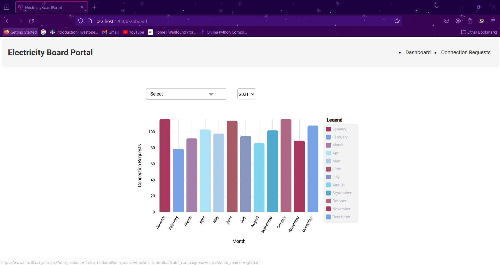

# ElectricityBoardPortal
 -  A web application for the Electricity Board staff with the capability to view and edit the connections made/requested by the user. 

 - This project was generated with [Angular CLI](https://github.com/angular/angular-cli) version 14.2.13 and [Django](https://www.djangoproject.com/) version 5.0.3.

## Getting Started with the Application

### Setting up the Application local - Frontend

 - Navigate to `/electricity-board-potal-frontend` and run `npm i`, this will install all the dependent angular libraries.

 -  Run `ng serve` for a dev server and  navigate to `http://localhost:4200/`. The application will automatically reload if you change any of the source files.

  ###  Application Description -   Dashboard Page

 - Once you hit the localhost url on your browser by default you will be redirected to `http://localhost:4200/dashboard` where you will be looking at the visual representation of monthly connection requested by the users.

 - Here from the multiselect option you can select filter the records based on the status and from the dropdown option you can select the year for which you want to visualize the data.

  ### Connection Requests Page

  - On the Navigation Bar uopn clicking the Connection Requests Button you'll be redirected to the Connection Requests Page i.e `http://localhost:4200/connection-request`.

  - Here you will be able to see first 10 records of the requests made by the user. For getting the other records you can use the Implemented Pagination.

  - Seach Filter - You can write any applicant ID and hit the search button, it will provide you the exact record matching that ID.

  - Date filter - Select the from and to dates and hit the apply button, you will be provided with the records that have date of application within these dates.

   - Reset - This button is used to reset to the initial view.

  ### Edit requests Popup

  - To Edit a connection request click on the edit button on the leftside of the specific record.

  - Here you can edit the fields of the connection request. (Not all fields can be edited like Date of Application, Govt ID Type, ID Number).

  - You can now save the records by clicking Submit Button and the record deatils will be updated, which can be viewed at the connection requests Page.

  

  ### Frontend Dependencies/Libraries Used

   - [ngx-charts 20.5.0](https://www.npmjs.com/package/@swimlane/ngx-charts?activeTab=readme)
- [AG Grid](https://www.ag-grid.com/angular-data-grid/modules/)
- [Angular Multiselect Dropdown](https://www.npmjs.com/package/ng-multiselect-dropdown#angular-multiselect-dropdown)

## Setting up the Application local - Backend

 - Navigate to `/electricity-board-api` and run `pip install -r requirements.txt`, this will install all the dependencies.

 -  Run `python manage.py migrate` to apply database migrations and run `python manage.py runserver` to start the development server. Navigate to `http://localhost:8000/`.

## ConnectionRequests

This class-based view handles GET and PATCH requests related to connection requests.

### GET Request

- To fetch a single application by ID, send a GET request with the application ID.
  - Example: `/api/connection-requests/<application_id>`
- To fetch all applications, send a GET request without any parameters.
  - Optional Query Parameters:
    - `to_date`: Filter applications by to-date (format: YYYY-MM-DD).
    - `from_date`: Filter applications by from-date (format: YYYY-MM-DD).

### PATCH Request

- To update an application, send a PATCH request with the updated data.
  - Required Data:
    - `ID`: ID of the application to be updated.
  - Additional Validations:
    - Cannot update Date of Application, Govt ID Type, and ID Number.
    - Load Applied cannot exceed 200 KV.

## MonthlyRequestsCountView

This class-based view fetches month-wise total numbers of applications for a specified year and statuses.

### GET Request

- Fetches month-wise total numbers of applications.
  - Query Parameters:
    - `year`: (Optional) Year for which data is requested (defaults to the latest year).
    - `status`: (Optional) Statuses to filter applications by.

## Error Handling

- Responses are handled for various scenarios including application not found and internal server errors.
- Proper error messages are returned along with appropriate HTTP status codes.
